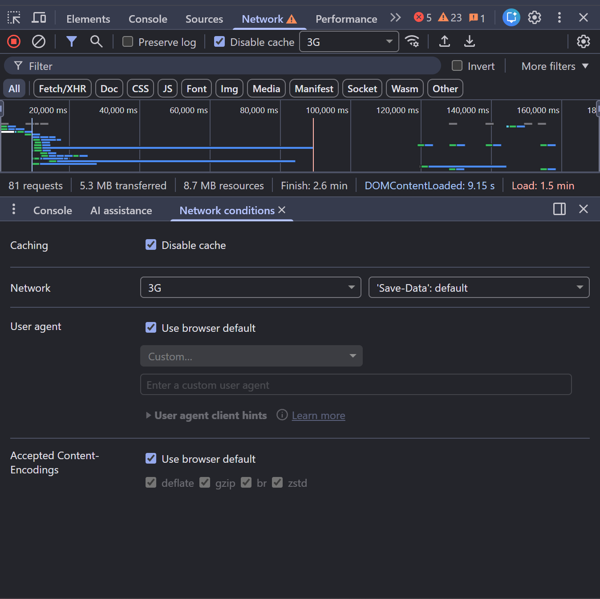
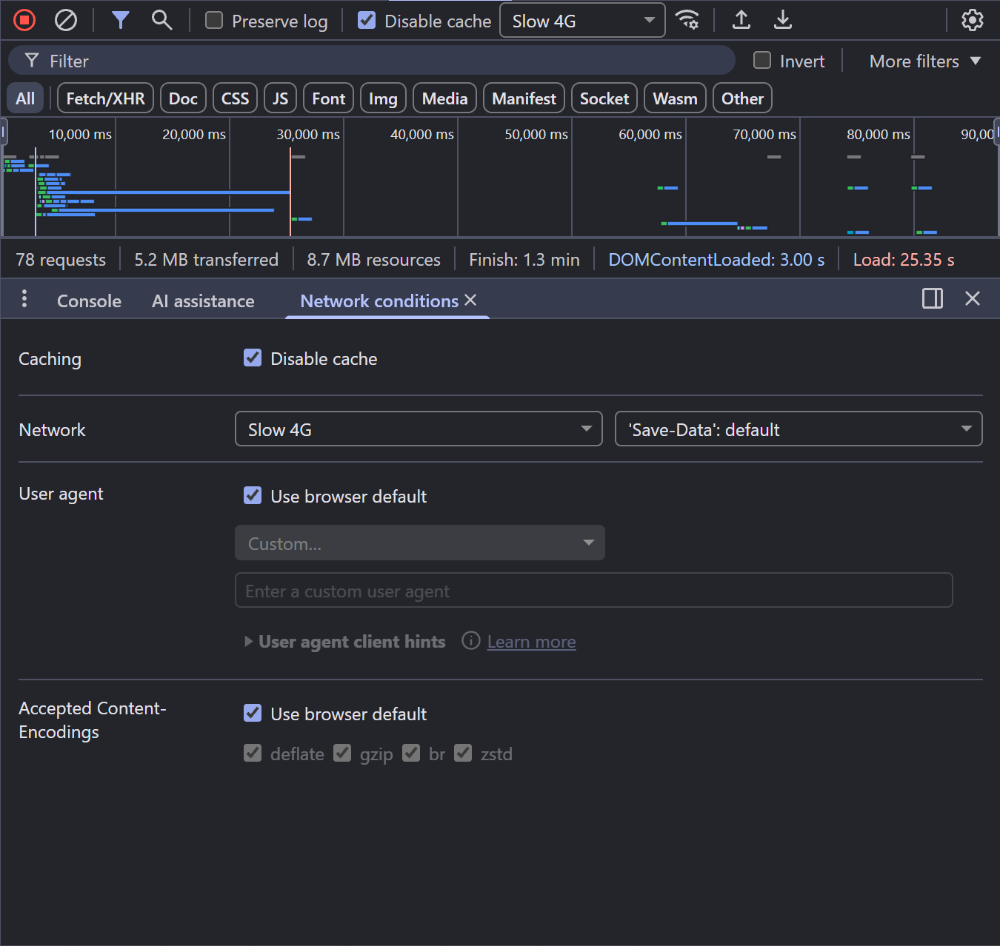
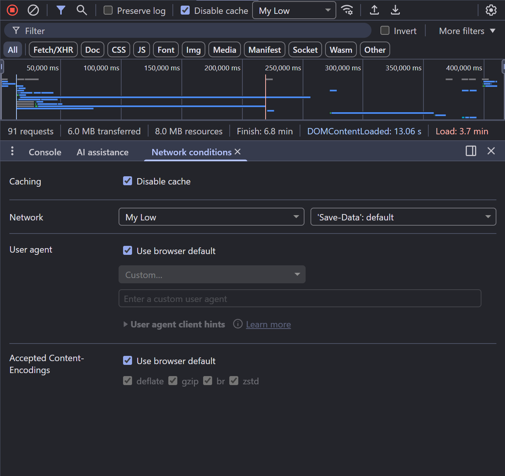
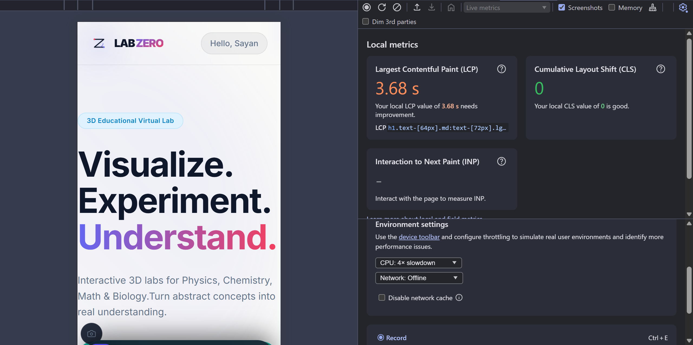

# LabZero - Online Lab Visualization Platform


LabZero is a browser-based virtual laboratory for science and mathematics education. It brings interactive simulations, 3D visualizations, gesture-enabled controls, curriculum-aligned daily challenges, and classroom-ready learning workflows into one modern learning platform.

The project is designed for students, teachers, and institutions that need practical digital lab experiences without depending on physical lab equipment. Concepts that are normally abstract, expensive, or difficult to demonstrate are converted into visual, interactive experiences.

## Table of Contents

- [Key Capabilities](#key-capabilities)
- [Product Highlights](#product-highlights)
- [Curriculum Coverage](#curriculum-coverage)
- [Architecture](#architecture)
- [Technology Stack](#technology-stack)
- [Getting Started](#getting-started)
- [Environment Variables](#environment-variables)
- [Available Scripts](#available-scripts)
- [End-to-End QA Testing](#end-to-end-qa-testing)
- [Project Structure](#project-structure)
- [Contributing](#contributing)
- [License](#license)

## Key Capabilities

- Interactive 2D and 3D simulations for Physics, Chemistry, Mathematics, and Biology.
- Curriculum-aware class filtering for Class 9, Class 10, Class 11, and Class 12.
- Daily challenge engine with class-specific question banks and progress tracking.
- Three.js and React Three Fiber powered visual models for immersive scientific exploration.
- Supabase-backed authentication for personalized student workflows.
- Teacher, student, institute, and admin dashboard experiences.
- Gesture-enabled interaction powered by MediaPipe Tasks Vision.
- Mathematical notation and scientific content rendering with KaTeX and React Markdown.
- Responsive frontend built with React, TypeScript, Vite, Tailwind CSS, and Motion.
- Django REST backend for APIs, users, classrooms, glossary, and lab data.

## Product Highlights

| Area | Description |
| --- | --- |
| Virtual Labs | Interactive experiments for refraction, electromagnetism, thermodynamics, mechanics, atomic structure, molecular models, genetics, plant physiology, calculus, trigonometry, vectors, and more. |
| Learning Flow | Students can select class and subject, explore modules, complete daily challenges, and review explanations. |
| Visualization | Uses canvas, SVG, D3, Recharts, Three.js, and React Three Fiber for scientific diagrams and model-driven learning. |
| Accessibility of Labs | Enables lab-style understanding where equipment, safety, or availability may be a blocker. |
| QA Focus | Tested under throttled networks, older-device CPU simulation, and Lighthouse performance audits. |

## Curriculum Coverage

LabZero is organized by subject and class so learners see only the content relevant to their current academic level.

### Physics

| Class | Topics |
| --- | --- |
| Class 9 | Refraction of Light |
| Class 10 | No active Physics topic assigned |
| Class 11 | Classical Mechanics, Thermodynamics |
| Class 12 | Electromagnetism, Wave Optics |

### Chemistry

| Class | Topics |
| --- | --- |
| Class 9 | Historical Models |
| Class 10 | Quantum Numbers |
| Class 11 | Atomic Structure, Molecular Structure, Advanced Experiment Lab |
| Class 12 | Periodic Trends, Quantum Configuration, Advanced Experiment Lab |

### Mathematics

| Class | Topics |
| --- | --- |
| Class 9 | Pythagorean Theorem, Probability |
| Class 10 | Approximating Pi, Trigonometry |
| Class 11 | Complex Numbers & Rotation, Linear Algebra |
| Class 12 | Vector Algebra, Calculus |

### Biology

| Class | Topics |
| --- | --- |
| Class 9 | Microorganisms |
| Class 10 | Cellular Anatomy |
| Class 11 | Plant Physiology |
| Class 12 | Genetics |

## Architecture

```text
LabZero
├── Frontend
│   ├── React 19 + TypeScript + Vite
│   ├── Tailwind CSS and Motion UI
│   ├── Three.js / React Three Fiber visualizations
│   ├── Subject modules, dashboards, simulations, and daily challenges
│   └── Supabase client integration
│
├── Backend
│   ├── Django 6
│   ├── Django REST Framework
│   ├── JWT authentication support
│   ├── Users, classrooms, glossary, and lab API modules
│   └── PostgreSQL/Supabase-ready configuration
│
└── docs
    └── QA screenshots and Lighthouse performance report
```

## Technology Stack

### Frontend

| Category | Tools |
| --- | --- |
| Framework | React 19, TypeScript, Vite |
| Styling | Tailwind CSS v4, Framer Motion, Motion |
| 3D Visualization | Three.js, React Three Fiber, React Three Drei |
| Charts and Data Visualization | D3.js, Recharts |
| Math and Content | KaTeX, react-katex, React Markdown |
| Authentication and Data | Supabase JS, Axios |
| Gesture Interaction | MediaPipe Tasks Vision |
| PWA | vite-plugin-pwa |

### Backend

| Category | Tools |
| --- | --- |
| Framework | Django 6 |
| API Layer | Django REST Framework |
| Auth | Simple JWT, Supabase-ready integration |
| Database | PostgreSQL via psycopg2 and dj-database-url |
| Deployment | Gunicorn, WhiteNoise, Docker |
| Configuration | python-dotenv |

## Getting Started

### Prerequisites

- Node.js 18 or later
- npm
- Python 3.12 or later
- PostgreSQL or Supabase project
- Docker Desktop, optional

### Run with Docker Compose

```bash
docker compose up --build
```

Default services:

| Service | URL |
| --- | --- |
| Frontend | `http://localhost:3000` |
| Backend | `http://localhost:8000` |

### Run Frontend Locally

```bash
cd Frontend
npm install
npm run dev
```

### Run Backend Locally

```bash
cd Backend
python -m venv venv
venv\Scripts\activate
pip install -r requirements.txt
python manage.py migrate
python manage.py runserver
```

For macOS/Linux, activate the virtual environment with:

```bash
source venv/bin/activate
```

## Environment Variables

### Frontend `.env`

Create `Frontend/.env`:

```env
VITE_SUPABASE_URL=your_supabase_project_url
VITE_SUPABASE_ANON_KEY=your_supabase_anon_key
VITE_API_URL=http://localhost:8000/api
GEMINI_API_KEY=your_optional_gemini_api_key
```

### Backend `.env`

Use `Backend/.env.example` as the starting point and configure database, secret key, debug mode, and allowed hosts for your environment.

## Available Scripts

Run these from the `Frontend` directory:

| Command | Purpose |
| --- | --- |
| `npm run dev` | Start the Vite development server. |
| `npm run build` | Create a production build. |
| `npm run preview` | Preview the production build locally. |
| `npm run lint` | Run TypeScript validation with `tsc --noEmit`. |
| `npm run signal` | Start the local signaling server. |

Backend commands:

| Command | Purpose |
| --- | --- |
| `python manage.py runserver` | Start the Django development server. |
| `python manage.py migrate` | Apply database migrations. |
| `python manage.py createsuperuser` | Create a Django admin user. |

## End-to-End QA Testing

LabZero includes manual end-to-end quality checks focused on real-world usability, network resilience, older-device behavior, and page performance. The following artifacts are stored in [`docs/qa`](docs/qa) and can be reviewed as part of the project handoff.

### QA Coverage Matrix

| Test Area | Scenario | Evidence | Result Observed |
| --- | --- | --- | --- |
| Network resilience | Chrome DevTools network throttling with `3G` profile and disabled cache. | [`network-throttling-3g.png`](docs/qa/network-throttling-3g.png) | Application remained inspectable under constrained bandwidth. Captured 81 requests, 5.3 MB transferred, DOMContentLoaded at 9.15 s, and full load at 1.5 min. |
| Network resilience | Chrome DevTools network throttling with `Slow 4G` profile and disabled cache. | [`network-throttling-slow-4g.png`](docs/qa/network-throttling-slow-4g.png) | Captured 78 requests, 5.2 MB transferred, DOMContentLoaded at 3.00 s, and full load at 25.35 s. |
| Network resilience | Custom low-bandwidth profile labeled `My Low`. | [`network-throttling-custom-low.png`](docs/qa/network-throttling-custom-low.png) | Captured 91 requests, 6.0 MB transferred, DOMContentLoaded at 13.06 s, and full load at 3.7 min. |
| Older-device simulation | Chrome DevTools Performance environment using CPU `4x slowdown`. | [`older-device-simulation.png`](docs/qa/older-device-simulation.png) | Local metrics showed LCP at 3.68 s and CLS at 0, confirming stable layout under simulated low-power conditions. |
| Lighthouse performance audit | Lighthouse report generated for performance testing. | [`lighthouse-performance-report.pdf`](docs/qa/lighthouse-performance-report.pdf) | Full Lighthouse performance report is included as a PDF artifact for audit review. |

### Network Throttling Evidence

#### 3G Profile



#### Slow 4G Profile



#### Custom Low-Bandwidth Profile



### Older-Device Simulation Evidence



### Lighthouse Performance Testing

The Lighthouse audit is available as a PDF:

[`docs/qa/lighthouse-performance-report.pdf`](docs/qa/lighthouse-performance-report.pdf)

### QA Notes

- Browser tooling used: Chrome DevTools Network and Performance panels.
- Cache state during throttling tests: disabled cache.
- Network profiles tested: `3G`, `Slow 4G`, and custom low-bandwidth profile.
- Device stress profile tested: CPU `4x slowdown`.
- Performance artifacts are committed as evidence for reproducibility and review.

## Project Structure

```text
.
├── Backend
│   ├── classrooms
│   ├── core
│   ├── glossary
│   ├── lab_api
│   ├── users
│   ├── manage.py
│   └── requirements.txt
│
├── Frontend
│   ├── public
│   ├── server
│   ├── src
│   │   ├── components
│   │   ├── context
│   │   ├── data
│   │   ├── hooks
│   │   ├── services
│   │   ├── simulations
│   │   ├── types
│   │   └── utils
│   ├── package.json
│   └── vite.config.ts
│
├── docs
│   └── qa
│
├── docker-compose.yml
└── README.md
```

## Quality Gates

Before submitting changes, run:

```bash
cd Frontend
npm run lint
npm run build
```

For backend changes, run migrations and start the server locally:

```bash
cd Backend
python manage.py migrate
python manage.py runserver
```

## Contributing

Contributions are welcome. Recommended workflow:

1. Create a feature branch.
2. Keep changes scoped and documented.
3. Run the relevant frontend and backend checks.
4. Add or update QA evidence when changing performance-sensitive, responsive, or simulation-heavy areas.
5. Open a pull request with a clear summary, screenshots where useful, and test notes.

## License

This project is licensed under the ISC License.
